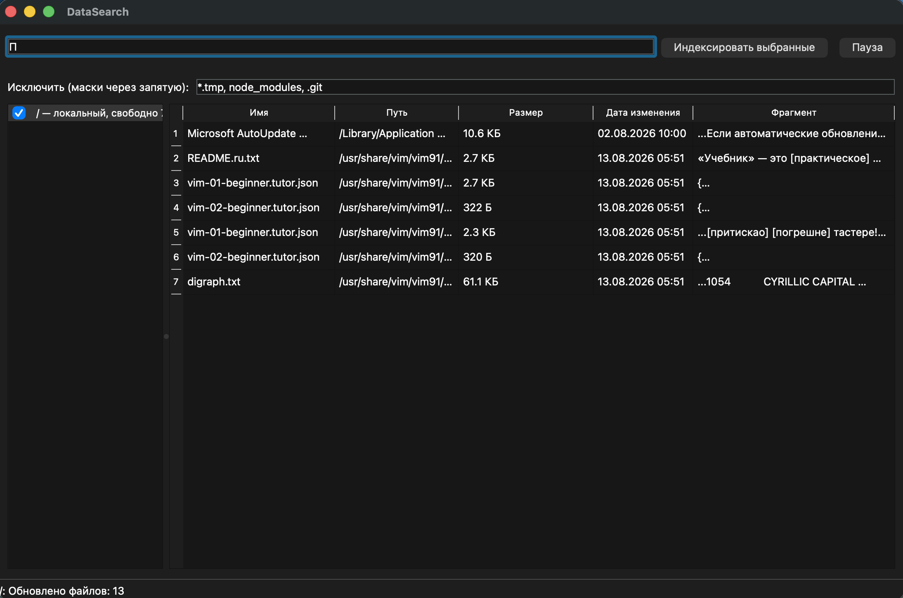

# DataSearch

Кроссплатформенный десктопный поиск по файлам — по принципам Elasticsearch (инвертированный индекс, токенизация, BM25-ранжирование), но полностью локально и офлайн. По духу ближе всего к **Everything** (Windows) или **Spotlight** (macOS), но с полнотекстовым поиском по содержимому файлов, включая DOCX/XLSX/PDF, и полноценной поддержкой русской морфологии.



## Возможности

- **Поиск по имени и содержимому файлов** — TXT, MD, исходный код, DOCX, XLSX, PDF.
- **Русская морфология**: поиск «практикум» находит «практикума», «практикумом», «практикумы» — собственная реализация алгоритма Snowball, подключённая как кастомный токенизатор SQLite FTS5.
- **Операторы запроса**: `"точная фраза"`, `-исключить`, `ext:docx`, `path:D:\Work\`.
- **Ранжирование по релевантности** (BM25) с подсветкой найденного фрагмента.
- **Индексация нескольких дисков/папок одновременно**, поиск агрегируется по всем выбранным источникам.
- **Живое отслеживание изменений** файловой системы (Windows: `ReadDirectoryChangesW`, macOS: `FSEvents`, Linux: `inotify`) — новые/изменённые файлы попадают в индекс автоматически, без ручной переиндексации.
- **Быстрая сверка при запуске**: индексы с прошлого сеанса открываются мгновенно, в фоне проверяются только изменения по метаданным, а не полное пересканирование.
- **Устойчивость к недоступным источникам**: если сетевой диск временно отключился, используется последний сохранённый индекс, а не удаление данных.
- **Пауза/возобновление индексации** без потери прогресса.
- Полностью офлайн — никаких сетевых запросов, никакой телеметрии.

## Статус по платформам

| Платформа | Статус |
|---|---|
| **macOS** | Реализовано и протестировано — приложение собирается и реально работает на машине разработки (диски через `getmntinfo`, Finder-интеграция через `NSWorkspace`, слежение за ФС через `FSEvents`). |
| **Windows** | Реализовано (`ReadDirectoryChangesW`, `ShellExecuteW`, `SHOpenFolderAndSelectItems`), но не собиралось и не запускалось — нет Windows-машины в среде разработки на момент написания. Требует сборки и проверки на реальной Windows-машине перед использованием. |
| **Linux** | Реализовано (`/proc/mounts`, `inotify`, `xdg-open`), но не собиралось и не запускалось — нет доступной Linux-машины. |

Ядро (индексация, поиск, извлечение текста, русский стеммер) — кроссплатформенное, покрыто автотестами и гоняется в CI/локально независимо от GUI-слоя.

## Сборка

### Требования

- CMake ≥ 3.21, компилятор с поддержкой C++20
- Qt6 (компоненты Core/Gui/Widgets — на macOS через Homebrew это лёгкий пакет `qtbase`, а не полный `qt`)
- SQLite3 (с поддержкой FTS5), zlib

### macOS

```bash
brew install cmake qtbase sqlite3
git clone <url-репозитория>
cd DataSearch
cmake -S . -B build
cmake --build build -j
./build/src/app/datasearch_app
```

### Windows

```powershell
# Qt6 и CMake должны быть в PATH
cmake -S . -B build
cmake --build build --config Release
.\build\src\app\Release\datasearch_app.exe
```

### Только ядро (без GUI, для CI/тестов на любой ОС)

```bash
cmake -S . -B build -DDATASEARCH_BUILD_APP=OFF
cmake --build build -j
ctest --test-dir build --output-on-failure
```

## Использование

1. Запустите приложение — слева отобразятся диски, видимые системе (как в Проводнике/Finder).
2. Кнопка **«Добавить папку...»** позволяет проиндексировать конкретную папку вместо целого диска — рекомендуется для первого знакомства, индексация всего системного диска может занимать долгое время.
3. Отметьте нужные источники галочками и нажмите **«Индексировать выбранные»**.
4. Ищите в строке поиска — результаты обновляются по мере ввода.

## Архитектура

```
src/
  core/       — платформонезависимое ядро: сканирование ФС, SQLite/FTS5-индекс,
                извлечение текста (DOCX/XLSX/PDF), русский стеммер, поиск
  platform/   — IPlatformService: диски, «показать в папке», слежение за ФС —
                отдельная реализация под Windows/macOS/Linux
  app/        — Qt Widgets UI
tests/        — автотесты ядра (ctest)
```

`core` не зависит от Qt и конкретной ОС — тестируется отдельно и переносится между платформами без изменений.

## Лицензия

[PolyForm Noncommercial License 1.0.0](LICENSE) — свободное использование в некоммерческих целях; для коммерческого использования нужно отдельное разрешение правообладателя.
